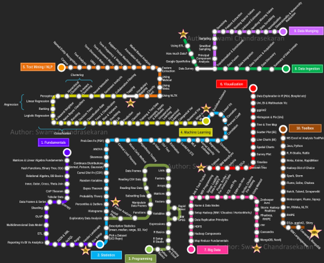

## Types of engineers

Before you hire a **Machine Learning Engineer** hire,

- Data Analyst
- Data Scientist
- Data Engineer (everyone depends on them!)

### Data Analyst

- **What**: Analyse prediction algorithms (models).
- **Uses**: Excel, SQL (Bonus: R / Python)
- Make direct analysis on data - less bugs and trying to get stuff to run.

#### Insight Analyst

Mainly: Look at data and extract useful data to later use.

Additional models

- Simple models like linear regression
- Time-series forecasting package from Facebook: [FB Prophet](https://facebook.github.io/prophet/docs/quick_start.html#python-api)
    - Spot weekly trends
    - Christmas trend (e.g. PosterXXL as Christmas gift)

## Data Science

- **What**: Write prediction algorithms (models).
- **Uses**: Python, R
- **Senior Data Scientist**: Write Production-Code

### Linear Models

Decision tree - Bäume mit Regeln

    E.g. **Gradient Boosting** and **Random Forst**:  Thousands of such trees are agregated.

- Examples:
    - Theft detection:
    - Kündigungsrate vorhersagen

### Natural language processing

Customer feedback form filtering: Sentiment Analysis

## Neural Networks

- [My talk about how similar Neural Networks are to the human brain](https://www.youtube.com/watch?v=NDQQkuEtFZs)

### Deep Neural Network vs. Statistical Data Algorithms

Biggest gain (as compared to classical neural networks) with the following data: text, images, videos.

Simple algorithms vs. costs to maintain a neural network.

Input: # of rooms, pool?, garden?, living space in square meter
Output: Price of house

### Recurrent Neural Networks

Examples:
  -
  - Composing music

- Get data into network in certain order (as compared to all at once in deep neural networks)
  - Given inserted words, deduce what the next word in the sentence may be.
  - Compose music

- Training of recurrent neural networks needs a lot of time and costs money
  - 200000 pounds costs to train network
- State-of-the-art

#### LSTM

- LSTMs forgets unimportant information.
- Standard RNNs possibly forget important information

- [My talk about Recurrent Neural Networks (German)](https://www.youtube.com/watch?v=-0r1ArmKugA&t=224s)

### Convolutional Neural Networks

A deep neural network where each layer is a

First layer

Erste Shicht: Simpel, nur Schatten.
- Augen und Nasen, dann Mund: Dunkle Punkte werden gesucht.
  - Nächste Schicht findet mehr details

## Data Engineer

- Set up database
- Make sure data is available
- Data streaming

production code

## Big data

### Structured data

- Data lies in databases or so called data lakes.

- Basically, only Banks, Amazon or Facebook have **BIG** data.
- For example, 1 Mio lines in SQL table does not qualify as BIG data yet.

If own database crashes, [Big Query from Google](https://cloud.google.com/bigquery) e.g. needs 2min to run through 2TB of data.

### Unstructured data

- For example: **CV**

## Examples

### Retail

ClickStream

#### Recommender Systems

1. Generic: Pick top sellers and other values from descriptive statistics.

2. **Content based filtering**: Article about covid 19 -> articles about pandemics

    Similarity based

Spotify: **Collaborative filtering**

    - user based attributes and product grading
    - You like `foo`, other people similar to you like `bar`, so the algorithm will recommend `bar` to you.
