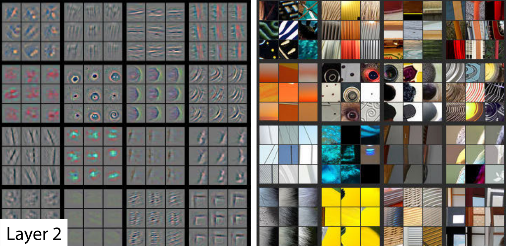

## Computer Vision

## terms

- Sampling: extra sampling
- Activition function
- Loss function
- **Transfer learning** (e.g. already use parameters trained on Resnet)
    - Sometimes early layers are freezed
    - fastai also has a gradually increasing learning rate (as layers are closer to features)
- Global avarage pooling.
- Reduce activiation map size by
    - a) Max Polling (formerly used)
    - b) Stride (schrittweite der convolution), e.g. stride size of 2 -> Don't do convolution on every pixel, but jump and delete jumped over pixels.

- Bottleneck feature -> Last step of feature extraction before classifier (nach global average pooling)

- **Random forest** (forest of randomized decision trees) nach CNN. --> Other open cv data.

- Precision and Recall
  - False Positive, False Negative
- Confused (deutsch "Verwechslung")
  - **Confusion matrix** lists pairs of most confusion aka wrong classifications.

- the easy split --> what is easy to separate.
    -> can lead to overfitting.

- **matplotlib** vs. **plotly**

## Data Preprocessing Architecture

- dataset (incl. data augmentation) + sampler --> data loader

    - image augmentation: Add different variants of the image (e.g. different crops and zooms) or different colors.

- Data Augementation: Filters, like grayscale, RGB augementation, corner augmentation etc.

### Architecture of a deep learning network

First layer:

### How to create explanatory images to explain what a layer is responsible for

- Images taken from the [fast.ai book chapter 2 (section "What Our Image Recognizer Learned")](https://github.com/fastai/fastbook/blob/master/01_intro.ipynb)

#### First layer

- Look at the neurons with highest activations.
- The neurons are directly connected to the input image.
- Look through all the images which are highly activated for a given neuron and search for similarities.


#### Deeper layers

1. Check for neurons with highest activations in a given deep layer.
2. Trace back these activations to the input layer (i.e. images) they're coming from.

    You're asking the question: Which neurons in previous layers had the biggest impact on neurons with highest activity in this layer?

3. For re-occuring activation patterns in a given layer (a square block of 9 activations in images on the left), try to make out semantic differences in the input image (corresponding block of 9 images on the right).

Layer 2



Layer 3


Layers 4 and 5


## Annotations

- Bounding box
- Instance segementation

### Error in classification of arial data

1. Streets vs. Parking lots

- Get more context!
    - Field of vision (aka. influence of pixels) Sichtweite anpassen.
    - How many pixels in previous layers influenced the specific activation map (feature map)?
        - This is usally a guassian curve -> pixels in the perifery influence the pixel less than pixels close to it.

2. Pools vs. trampolines

- hard-negative mining
    - sample cases in which neural network has a hard job and let them be labeled.
    - Get new data which is useful for you.
- relabeling --> new pseudo-classes

- over-sampling: Create new image data by randomly copying different parts of the image to create new ones.

    e.g. Filter for zebra stripes.

    ```python
    [
        -1, -1, 1
        -1, -1, 1
        -1, -1, 1
    ]
    ```

- ReLu activiation function is non-linear
    - if linear, the whole Neural network would not be helpful, because I could just create another linear function f3 where f3 = f2(f1(x)) as a linear combination.

## Images used for non-image tasks

e.g. audio processing

See fast.ai book [section Image Recognizers Can Tackle Non-Image Tasks](https://github.com/fastai/fastbook/blob/master/01_intro.ipynb#What-Our-Image-Recognizer-Learned)