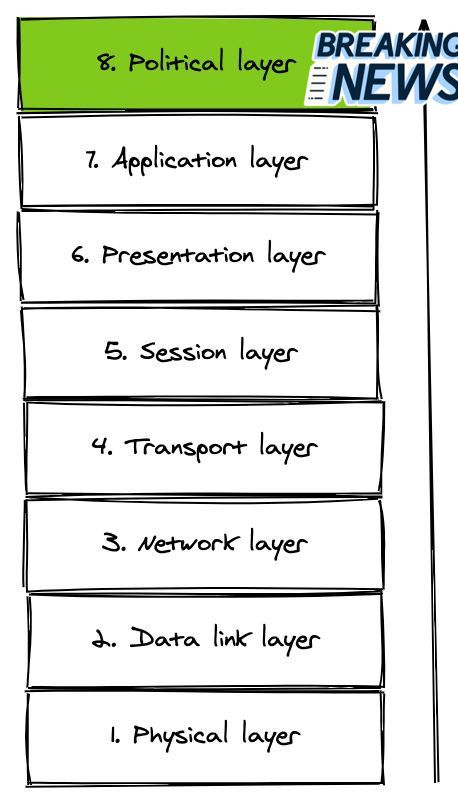

## Politics in IT

Found **Breaking News: New Layer Discovered in the OSI-Model** [here](https://www.linkedin.com/posts/julian-hansert_breaking-news-new-layer-discovered-in-the-activity-6759002107774304256-yRMp) with this image



## Performance


- **KPI**s: Key Performance Indicators
- **OKR**s: Objectives and Key Results

  > Link between ambition and reality.

  - **Objective** is where do you want to go?
  - **Key Results** are how you'll assess whether you got there or are still on your way to get there.

This article discusses [differences between KPIs and OKRs](https://www.perdoo.com/resources/okr-vs-kpi/).

- [Basecamp - Shape Up](https://basecamp.com/shapeup) - [different parts](https://basecamp.com/shapeup)

# How to report bugs (Issue Style Guide)

## Bugs

Please use the following format to report bugs as a JIRA issue:

1. **Summary**

   Try to use approximately 10 words. Can be the title of the issue.

1. **Location**

   Where can I find the bug? Add a link.

1. **Steps to reproduce**

   Exact steps with all necessary details to reproduce the bug. Preferably use a numbered list.

1. **Expected Results**

   Expected correct behavior: State what should be happending.

1. **Actual Results**

   Observed issue: State the problem which has to be solved.

See the [MDN bug writing guidelines](https://developer.mozilla.org/en-US/docs/Mozilla/QA/Bug_writing_guidelines) for more infos.

### Examples (taken from Museum Curator)

The following examples may not be perfect but serve as a quick demonstration.

#### Example 1:

##### Summary:

Tour should at least contain one waypoint

##### Location:

Editing tours, e.g.: [http://staging.myApp.de/#/tours/25]()

##### Steps to reproduce:

1. Create a new tour with all attributes, but without waypoints
2. Save the tour

##### Expected Results:

Show error message "A tour has to include at least one waypoint" and remain in "edit" mode

##### Actual Results:

Tour is saved without a single wayoint

---

#### Example 2 (in German):

##### Summary:

Wegbeschreibung Audio verschwindet manchmal aus UI / kann nicht mehr abgespielt werden
<span style=„color:blue“>hi</span>

##### Location:

z.B. [http://staging.myApp.de/#/tours/25]()

##### Steps to reproduce:

1. Erstelle Tour mit 2 Objekten
2. Füge je Objekt für beide Sprachen eine Audio-Wegbeschreibung hinzu (insgesamt also 4)
3. Gleich darauf: Speichere Tour
4. Lade andere Seite (z.B. Objekte)
5. Gehe zurück zur Tour
6. Versuche alle Audio-Wegbeschreibungen abzuspielen

##### Expected Results:

Lade vormals geaddete Audios und erlaube Abspielen

##### Actual Results:

Manche Audios nicht mehr vorhanden

# Workflow

_Best practices for improving our general workflow._

---

<!-- add more best practices regarding the overall workflow -->

## Change Log

For every Frontend-project we keep a change log (`CHANGELOG.md` on highest project level). The change log follows the structure of [Keep a CHANGELOG](http://keepachangelog.com/en/0.3.0), with the difference that breaking changes lead to a version bump of the minor instead of the major part. For every change or feature we implement there must be an entry in the change log as described below, this entry should be part of our code review process.

The change log file has an empty "blueprint" section at the top, which can be used to add new features until the next release:

```markdown
# <PROJECT_NAME>

<!-- blueprint for adding changes and new features -->

## [#.#.#] - next release

### Breaking Change

### Changed

### Added

<!-- old entries, sorted by version & date -->

## [X.X.X] - yyyy-mm-dd

### Breaking Change

- ...

### Changed

- ...

### Added

- ...
```

On every release, the current blueprint will be completed with the version and the date of the release and a new blueprint will be added.

Use the three section like the following:

- **Breaking Change**: A change or new feature (might also be introduced in the backend) which changes the code or the setup in a way, that an older version will not work anymore.
- **Changed**: An existing feature was improved, removed or a bug was fixed.
- **Added**: Something new was introduced to the project.

To improve the change log entries and to get a fast overview on what happended, the following annotation can be used:

- **Bug-Fix**: Prepends every bug-fix.
- **Internals**: Changes to the setup or to internal features (scripts, tools, etc.).
- **Android / iOS**: Platform specific changes.

Example:

> `- Bug-Fix: Map-related components are refactored; correct latitudes and longitudes are stored.`

New annotations should be introduced wisely.

## Define coding best practices and style guide

see [programming-style.md](../programming-style.md)