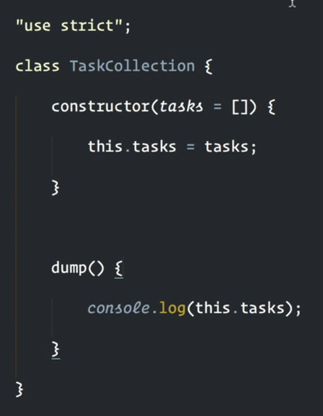
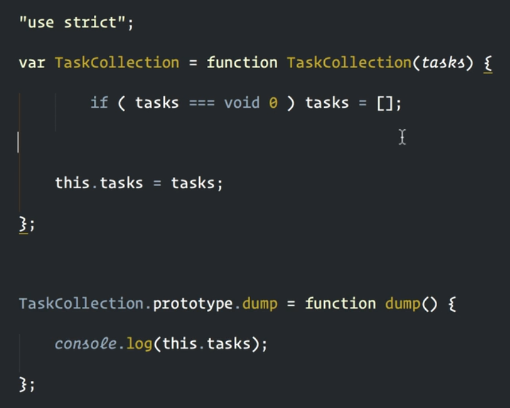

## JS Hacks

- life hack: console log function that auto-indents based on the depth of your call stack ([Tweet from Sophie Alpert](https://twitter.com/sophiebits/status/1058448900460138497)):

  ```javascript
  function log(message) {
    console.log(
      '  '.repeat(new Error().stack.match(/\n/g).length - 2) + message
    )
  }
  ```

## DOM manipulation

Use DOM id/class/... names

```js
document.getElementById('fb-root')
```

Use CSS selectors

```js
document.querySelector('.ng-scope')
```

## Javascript Event Loop

Participants: Event stack, web APIs, task queue, event loop

Javascript runs an [event loop](http://2014.jsconf.eu/speakers/philip-roberts-what-the-heck-is-the-event-loop-anyway.html) in which functions can be registered to run in the next iteration of the never ending single-threaded loop.

- `setTimeout(..., 0)` deferes code in the callback function to be executed when the event stack is empty.

  ```js
  setTimeout(function() {
    console.log('hello')
  }, 0)
  ```

### Synchronous code

Code which is **not** called as a call-back from another function (i.e. registered to be executed in the next iteration) and is called in the current iteration is blocking the event loop.

### Asynchronous code

Registers an `event handler` (a **callback** routine) and doesn't block the event loop.

With callback JS is concurrent out of the box.

## Javascript - Common Errors + Solutions

[JavaScript Not Working? Start with the 10 Most Common Mistakes JavaScript Developers Make](http://www.toptal.com/javascript/10-most-common-javascript-mistakes)

e.g. Common Mistake #6: Incorrect use of function definitions inside for loops:

Solution: Use an outer function + inner callback function

```js
var elements = document.getElementsByTagName('input')
var n = elements.length // assume we have 10 elements for this example
var makeHandler = function(num) {
  // outer function
  return function() {
    // inner function
    console.log('This is element #' + num)
  }
}
for (var i = 0; i < n; i++) {
  elements[i].onclick = makeHandler(i + 1)
}
```

Explanation: `i` would not present in function in for loop. By creating a closure it then is present in the inner function returned.

## Web Requests

The global `fetch` function is an easier way to make web requests and handle responses than using an `XMLHttpRequest`.

#### XMLHttpRequest

```js
function loadDoc() {
  var xhttp = new XMLHttpRequest()
  xhttp.onreadystatechange = function() {
    if (xhttp.readyState == 4 && xhttp.status == 200) {
      document.getElementById('demo').innerHTML = xhttp.responseText
    }
  }
  xhttp.open('GET', 'demo_get2.asp?fname=Henry&lname=Ford', true)
  xhttp.send()
}
```

#### Fetch

- working with Promises.
- with ES6 (Babel) (as used in `react native` tutorial):

```js
fetchData: function() {
    fetch(REQUEST_URL)
      .then((response) => response.json())
      .then((responseData) => {
        this.setState({
          movies: responseData.movies,
        });
      })
      .catch(err => console.log(err))
      .done(); // always make sure to call done() or any errors thrown will get swallowed.
  },
```

`fetch` returns a Promise, `response.json()` again returns a Promise which can then be resolved to yield the response data if successful.

#### jQuery `$.ajax()`

```js
var menuId = $('ul.nav')
  .first()
  .attr('id')
var request = $.ajax({
  url: 'script.php',
  method: 'POST',
  data: { id: menuId },
  dataType: 'html',
})

request.done(function(msg) {
  $('#log').html(msg)
})

request.fail(function(jqXHR, textStatus) {
  alert('Request failed: ' + textStatus)
})
```

or

```js
// Assign handlers immediately after making the request,
// and remember the jqXHR object for this request
var jqxhr = $.ajax('example.php')
  .done(function() {
    alert('success')
  })
  .fail(function() {
    alert('error')
  })
  .always(function() {
    alert('complete')
  })

// Perform other work here ...

// Set another completion function for the request above
jqxhr.always(function() {
  alert('second complete')
})
```

## strict mode

Add the following line at the **beginning** of your script!

```js
'use strict'
```

[JavaScript Use Strict](http://www.w3schools.com/js/js_strict.asp)

## `with`

in the following example `Math` is added to the top of the scope chain and thus you don't have to write `Math.PI`.

```js
var a, x, y
var r = 10

with (Math) {
  a = PI * r * r
  x = r * cos(PI)
  y = r * sin(PI / 2)
}
```

see [with statement documentation](https://developer.mozilla.org/en/docs/Web/JavaScript/Reference/Statements/with).

## Misc commands

### several expressions on one line with parentheses ()

```js
function C() {
  ;(function f() {
    console.log('i am f')
  },
    (function x() {
      console.log('i am x')
    })(),
    (y = 2),
    console.log('hello'))
}
```

As for the y === 2, this is because you did not var y; inside C, so y = 2 sets window.y, and in the global scope this === window.

## Functional JavaScript

- [An Introduction to Functional JavaScript](http://www.sitepoint.com/introduction-functional-javascript/)

--> see separate file `Functional Javascript.md`

## File i/o

- [Reading files in JavaScript using the File APIs](http://www.html5rocks.com/en/tutorials/file/dndfiles/)

## console.log()

#### console.log() vs. console.dir()

##### Current state

- console.log(JSON.stringify(a));
- console.dir(a);

#### Ansi color in console.log

For example

```js
console.log('\x1b[41m\x1b[37m%s\x1b[0m', 'FAILED', result)
console.log('\x1b[36m%s\x1b[0m', 'I am cyan') //cyan
```

[console.log object at current state](http://stackoverflow.com/questions/7389069/console-log-object-at-current-state)

## Literal vs. Object

- Array Literal

      	```js
      	['eat', 'bananas']
      	```

- Array Object

      	```js
      	new Array('eat', 'bananas')
      	```

## `apply()`, `call()`, `...` (spread operator)

_UNDER_CONSTRUCTION_

[apply()](https://developer.mozilla.org/en-US/docs/Web/JavaScript/Reference/Global_Objects/Function/apply)
[... spread operator](https://developer.mozilla.org/en-US/docs/Web/JavaScript/Reference/Operators/Spread_operator)

## `bind()`

Example from [MDN](https://developer.mozilla.org/en/docs/Web/JavaScript/Reference/Global_objects/Function/bind):

In `bind(context, [variable1, variable2, ...])` the `context` will be bound as `this` to the newly created `bound function`.

```js
this.x = 9
var module = {
  x: 81,
  getX: function() {
    return this.x
  },
}

module.getX() // 81

var retrieveX = module.getX
retrieveX()
// returns 9. The function gets invoked at the global
// scope.

// Create a new function with 'this' bound to module
// New programmers might confuse the
// global var x with module's property x
var boundGetX = retrieveX.bind(module)
boundGetX() // 81
```

## Common.js (modules)

#### ES6+ syntax

- Alternative 1

      	```js
      	const foo = () => { ... }
      	export default foo;
      	```

      	```js
      	import foo from './foo';
      	```

- Alternative 2

      	```js
      	export const foo = () => { ... }
      	```

      	```js
      	import { foo } from './foo';
      	```

#### ES5 and older syntax

Use `import` and `export` statements to require modules.

[Understanding module.exports and exports in Node.js](http://www.sitepoint.com/understanding-module-exports-exports-node-js/)

#### Own modules

##### Export module

```js
var foo = "Hello";
var bar = function() { console.log("Amazing!" };

module.exports = { foo: foo, bar: bar };
```

##### Import module

```js
require('../actions/foobar.js')
```

_or_

```js
var Bar = React.createClass({ ... });
module.exports = Bar;
```

```js
require('../actions/Bar')
```

### Add third-party module (file with js functions)

`require` command

var express = require('express');

## Immutability in JS

Don't mutate an object, but create a new one with the change, i.e. change the reference

- Vanilla JS

      	```js
      	// objects
      	var yourCarRepainted = Object.assign({}, yourCar, { color: 'red' });
      	// array
      	var changedList = [].concat(list);
      	```

- immutable.js

## switch-case

Chain cases:

```js
case 'BackAction':
case 'back':
case 'pop':
	return currentState.index > 0 ?
		NavigationStateUtils.pop(currentState) :
		currentState;
```

## Promises

Inside a `then()` chain, `resolve()` function call let's it directly jump to next `then()`.

## rest vs. spread operator `...`

- `rest` operator gives you rest of input arguments as array. \* should always occur at end of the list
- `spread` operator splits array into single arguments for a function.

## Cool stuff

If `hasClose` is false, the Button will not be shown..

```js
{
  hasClose && (
    <ButtonIcon
      style={styles.closeButton}
      themeProps={closeThemeProps}
      icon="close"
      onPress={onClose}
    />
  )
}
```

## Prototypes

see [this excerpt out of the book `SpeakingJS`](http://speakingjs.com/es5/ch17.html#prototype_relationship)

Only getting a property considers the complete prototype chain of an object. Setting and deleting ignores inheritance and affects only own properties.

#### Prototypes

##### Create an object with properties of a prototype

Given the object

```js
var PersonProto = {
  describe: function() {
    return 'Person named ' + this.name
  },
}
```

Create a new object with property `describe` inherited from prototype `PersonProto` and property `name` as an **own** property:

```js
var jane = Object.create(PersonProto)
jane.name = 'Jane'
```

or less common:

```js
var jane = Object.create(PersonProto, {
  name: { value: 'Jane', writable: true },
})
```

Here creating an object `B` where it's properties are all inherited from `A`:

```js
var A = {}
var B = Object.create(A)
```

##### Generic Methods: Borrowing Methods from Prototypes

Call it like so

```js
Object.prototype.hasOwnProperty.call(obj, 'foo')
```

or shorter like so

```js
{}.hasOwnProperty.call(obj, 'foo')  // shorter
```

##### Property Attributes and Property Descriptors

Properties can be added via descriptors

```js
Object.create(proto, propDescObj?)
```

##### Constructors & Instances --> Creating prototypes

By convention, the names of constructors start with uppercase letters

```js
function Person(name) {
  this.name = name
}

Person.prototype.describe = function() {
  return 'Person named ' + this.name
}

var jane = new Person('Jane')
jane.describe() // 'Person named Jane'
```

#### With ES6+ syntax `Class` is shortcut for setting prototype.

- ES6

      	

- is compiled to:

      	

## Generators

From [ES6 generators explained](http://2ality.com/2015/03/es6-generators.html)

Here not a generator function is used after `yield*`, but another iterable.

```js
function* bla() {
  yield 'sequence'
  yield* ['of', 'yielded']
  yield 'values'
}

let arr = [...bla()]
// ['sequence', 'of', 'yielded', 'values']
```

## Links

- Interesting JS topics mentioned, like e.g. _event delegation_:
  [Seven JavaScript Things I Wish I Knew Much Earlier In My Career](http://www.smashingmagazine.com/2010/04/seven-javascript-things-i-wish-i-knew-much-earlier-in-my-career/#event-delegation)
- [ECMAScript6 commands](http://es6-features.org/#Lexicalthis)
- [Seven JavaScript Things I Wish I Knew Much Earlier In My Career](https://www.smashingmagazine.com/2010/04/seven-javascript-things-i-wish-i-knew-much-earlier-in-my-career/#event-delegation)
