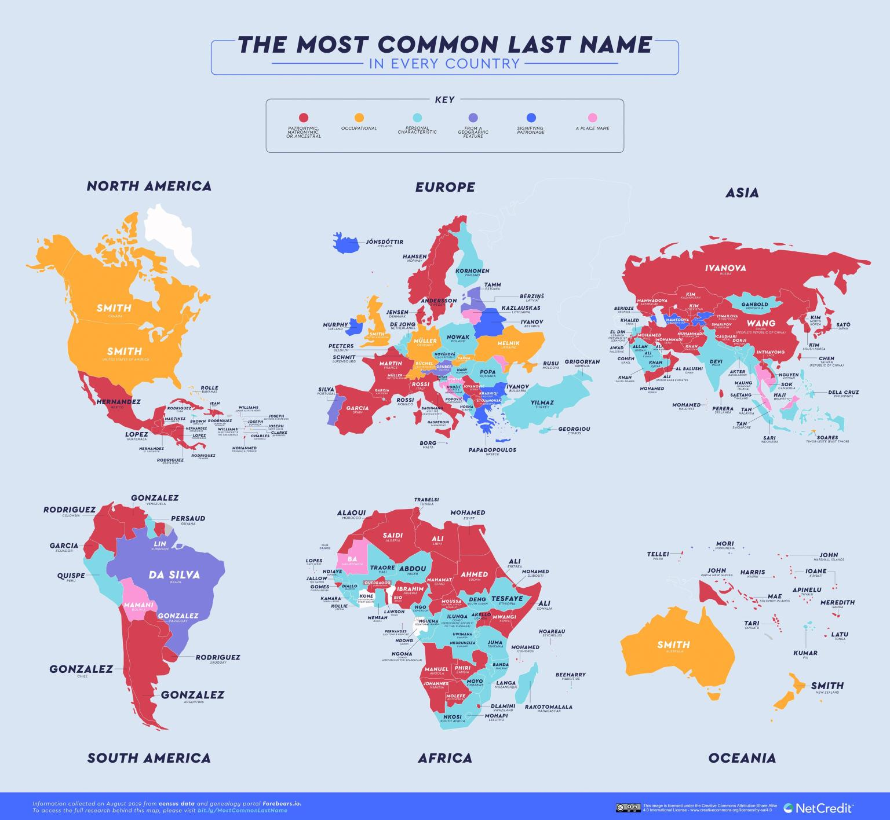
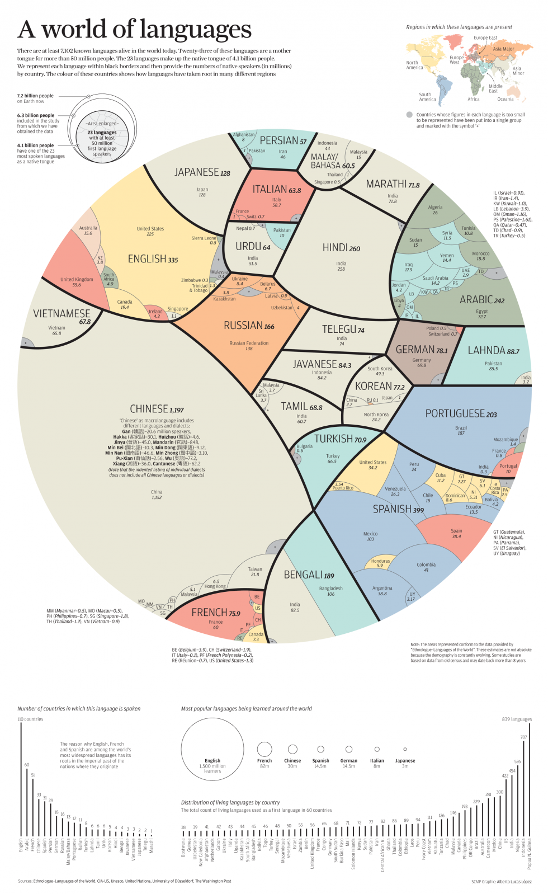

## General

- How to best learn a language?

  - [Best video on language learning. Period.](https://youtu.be/illApgaLgGA)

- Language Negotiation

  - [How to better learn languages in real life situations](http://www.mezzoguild.com/negotiation-in-language-learning/)

- Most popular last names per country

  

- [Learn your target language now!](https://www.linkedin.com/pulse/learn-your-target-language-now-melanie-gierszal?trk=hp-feed-article-title-comment)

- [Memrise - language learning with fun hints and tips](https://www.memrise.com/)

### Linguistics

- Languages spoken in the world

  

-

## Language specific

### Mandarin Chinese

- [German Blog about Chinese](https://www.chi-nesisch.de/basiswissen-ueber-chinesisch/toene-der-chinesischen-sprache/)
- [Outlier Linguists Chinese Course](https://outlier-linguistics.thinkific.com/courses/take/mandarin-pronunciation-accent-masterclass/)

#### Tones

- [Glossika Tone Training Files](https://sites.google.com/view/glossika-tone-training-files/home)

  - Link to downloads of training files of 2-character and 3-character combos.
  - The files also include 10x repetitions of words to really learn it thorougly.

- [Chinese - Nice video intro from Yoyo Chinese](https://youtu.be/3wV8B4bx1lM)

##### Tone changing rules

- [看这片很好的视频](https://youtu.be/rxNHIdn_xjE)

1. Always: 3 + 3 -> 2 + 3
2. Only for 不：4 + 4 -> 2 + 4
3. Only for 数字《一》你算数字时时第一声，可是在任何其他情况下是第四声！而且也遵守上面的规律。4 + 4 -> 2 + 4
   例子：
    - 一杯水 Yìbēi shuǐ （Google gets the 拼音 wrong!）
    - 一起 Yìqǐ
    - 一路 yílù; 一個 yíge (2nd - neutral, but originally a 4th) --- this one is super important!
    - 一條路 yì tiáo lù

- [Summary from hackingchinese.com](https://www.hackingchinese.com/optional-obligatory-tone-change-rules-mandarin/)
  - Obligatory rules: The three above rules
  - Optional tone change rules:
    - 动物 4-4 becomes a slighter 4 and a 4
    - 一年级 yīniánjí (grade one) turns into yīniānjí.

- [Another resource covering the tone change rules with examples](https://resources.allsetlearning.com/chinese/pronunciation/Tone_changes_for_third_tones)
  > Sometimes multiple third tones in a row will be broken up by pauses. In this case, the last word/character in each "group" will be pronounced as a third tone.


#### Pinyin - 拼音

Here are all the possible pinyin letters:

```
āáǎà

ēéěè

īíǐì

ōóǒò

ūúǔù

ǖǘǚǜ
```

#### 中国电影与电视剧

[10 Chinese TV Shows to Help You Learn Mandarin](https://www.writtenchinese.com/10-chinese-tv-shows-to-help-you-learn-mandarin/)

- 最近在开
  - 何以笙箫默

### Cantonese

- [CantoDict sentences, hundreds of Cantonese sentences an audio:](http://www.cantonese.sheik.co.uk/scripts/examplelist.htm)

### Japanese

- [Great tips on resources](https://events.ccc.de/congress/2019/wiki/index.php/Session:Japanese_(Reading)_Beginner_to_Expert)

### English

#### Loosing your accent

[Nice video with tips](https://youtu.be/oUD2gUmdzeI)

**Methods**:

- Shadowing

    - See [Outlier Linguists Chinese Course](https://outlier-linguistics.thinkific.com/courses/take/mandarin-pronunciation-accent-masterclass/) talking about this method.

- Reading book + Audiobook -> Connection of words + sounds
- Sentence mining

    - See [Outlier Linguists Chinese Course](https://outlier-linguistics.thinkific.com/courses/take/mandarin-pronunciation-accent-masterclass/) talking about this method.

## Tools

### Language learning apps

- [Duolingo - Great to learn the basics](https://www.duolingo.com/)

    - **What?**: Learn by translating back and forth

    - **PRO**: Good for starting out with a totally new language
    - **CON**: Sentences often not really useful
    - **CON**: Learned words don't really stick

- [Fluentu - Learn with real videos - it's fun and a good way to learn real expressions from daily life](https://www.fluentu.com/)

    - Learn with real videos (ads, youtube videos, children language learning shows etc.)

- [Memrise](https://www.memrise.com/)

    - Learn with mnemonics (Eselsbrücken)

- [Rosetta Stone](https://www.rosettastone.de/)

    - Learn like kids do.

- [Busuu](https://www.busuu.com/en/hello-new)

    - Recommended by Heiki

### Learning pronunciation

- [**Forvo**: The pronunciation dictionary](https://forvo.com/)

  Native speakers pronounce words for you (often with different dialects to choose from).

- [Speechling](https://speechling.com/app)

  - Repeat phrases, see your sound wave pattern and compare it to native speakers' pronunciation.
  - Listen to native speakers and send up to 10 phrases a month for them to give you feedback (more phrases in paid version).

- [**how to pronounce**](https://www.howtopronounce.com/chinese/%E5%BE%88%E4%B9%90%E6%84%8F%E5%9B%9E%E7%AD%94)

  Native pronunciations.

- [Audacity](https://www.audacityteam.org/)

  - Audio software to analyze your pronunciation via sound wave patterns
  - Record your own audio and download native speakers' audio

### Speak with natives online

- [Omegle](https://www.omegle.com/)

  - Talk to strangers online

### 1-on-1 lessons

- [Preply](https://preply.com/)

    - My [referral link](https://preply.com#_prefMTM5NTIwOA==)

- [iTalki](https://www.italki.com/)

    - If you want to learn there use [this link](https://www.italki.com/i/Bdfb6D?hl=en-us) to support me.

- [Chatterbug](https://chatterbug.com/en/)

    - Where Tilman works

### Not tried yet

- [Tatoeba](https://tatoeba.org/eng/)

  - Collection of sentences and translations - some with audio
  - Useful for **sentence mining**

- [Glossika](https://ai.glossika.com/)

  - Smart technology, adaptive learning algorithm and structured content.

- [Babbel](https://www.babbel.com/)
