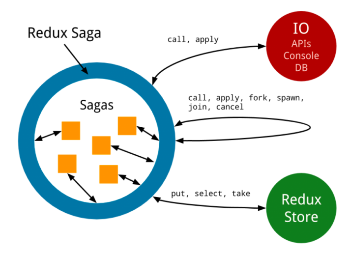

## `task`

A `task` (descriptor) is a non-blocking call and is created by a `fork` in **redux-sagas**

* To cancel a forked `task` use the dedicated effect `cancel`.
* Cancellation of a task propagates downwards (in contrast returned values and uncaught errors propagate upward)

## `yield` vs. `yield*`

See [this answer of the creator of redux-saga](https://github.com/redux-saga/redux-saga/issues/124#issuecomment-185129000):

> `yield*` allows only for sequential compositions (like macro tasks in C/C++)

## `race`

`race` automatically `cancels` the loser effects.

## you always have to `yield` in order to get the value

```js
return yield call(setActionToDiscovery, lastDiscoveryTask);
```

instead of just

```js
return call(setActionToDiscovery, lastDiscoveryTask);
```

## `takeEvery` vs. `while (true)` without `fork`

If you are using `while (true)` inside sagas to `take` all events without forking what comes thereafter, so you might miss some events while the saga is still executing.
If it’s your intention to not `take` other events of this type as long as you’re running that specific saga, all is good.

In case you do want to catch all events, a good fix would be to use `takeEvery`.

* See [https://github.com/redux-saga/redux-saga/issues/760#issuecomment-273737022]()
* or [https://stackoverflow.com/questions/42938520/redux-saga-when-to-use-fork]()
* or [https://stackoverflow.com/questions/39438005/what-is-the-idiomatic-way-of-starting-rootsaga/39447488#39447488]()


## Channels

- Async stuff not related to redux actions etc.
- Other listeners!

## TypeScript

Great article about [redux-saga + TypeScript](https://tech.lalilo.com/redux-saga-and-typescript-doing-it-right).

### Image

Redux-saga visually explained:

