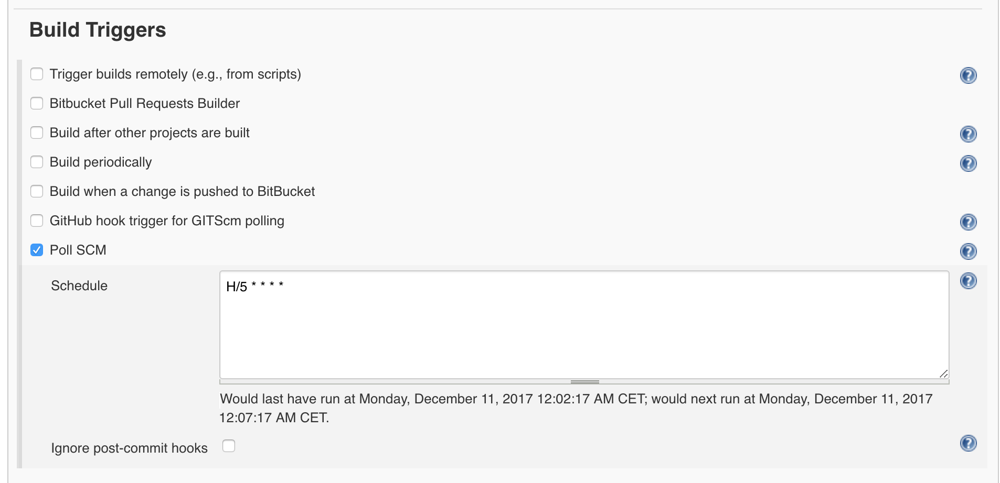

## Where

Jenkins Projects are saved in `~/.jenkins/workspace/` on your Continuous Integration server.

## Tipps

* Start Shell scripts with the `-l` tag, i.e. `#!/bin/bash -l`

	e.g. here it's only executing a script which is in version control.

	```bash
	#!/bin/bash -l

	./internals/scripts/build-cms.sh
	```

## How to

#### Execute tasks on remote server

1. Use [Publish Over SSH Plugin](https://wiki.jenkins-ci.org/display/JENKINS/Publish+Over+SSH+Plugin)

	**Advantages: SSH keys can be used for authentication and servers can be named --> easier to distinguish**

	[Instructions](http://julianhigman.com/blog/2012/02/25/using-jenkins-to-run-remote-deployment-scripts-over-ssh/comment-page-1/)

	1. Add new ssh connections in `Manage Jenkins/Configure System/Publish over SSH`

		Add private ssh key + then add ssh connections for this key

	2. Add build step `Send files or execute commands over SSH`

2. Use [SSH plugin](https://wiki.jenkins-ci.org/display/JENKINS/SSH+plugin) together with [SSH Credentials Plugin](https://wiki.jenkins-ci.org/display/JENKINS/SSH+Credentials+Plugin)

	**Disadvantage: No SSH keys can be used, need to use password**

	1. Add new ssh connections in `Manage Jenkins/Configure System/SSH remote hosts`

		Add ssh connections with username and passwords

	2. Add build step `Execute shell script on remote host using ssh`

#### Evaluate Groovy Script

```java
def map = [ : ]

if ("development".equals(SERVER)){
  map << [IP_PRIMARY: "46.101.163.224"];
  map << [TARGET_BRANCH: "production_digitalocean"];
}
if ("production".equals(SERVER)) {
  map << [IP_PRIMARY: "46.101.186.100"];
  map << [IP_BACKUP: "139.59.128.79"];
  map << [TARGET_BRANCH: "master"];
}
return map;
```

```java
if(PLATFORM.equals("ios")) {
  if(BUILD_TYPE.equals("alpha") || BUILD_TYPE.equals("beta") || BUILD_TYPE.equals("feature")) {
    return ['hockey']
  } else if(BUILD_TYPE.equals("release")) {
    return ['testflight', 'appstore']
  }
} else if(PLATFORM.equals("android")) {
  if(BUILD_TYPE.equals("alpha") || BUILD_TYPE.equals("beta") || BUILD_TYPE.equals("feature")) {
    return ['hockey']
  } else if(BUILD_TYPE.equals("release")) {
    return ['playstore','playstore-beta','playstore-alpha']
  }
}
```

### Pipeline scripts

An example pipeline for the task **Proxipedia Website - Attraction List** which fetches the newest list of attractions to the Proxipedia Website.

```js
pipeline {
    agent any
    triggers {
        cron('H/30 * * * *')
    }
    stages {
        stage('Download attractions.json from CMS backend') {
            steps {
                sh 'curl https://beta-api.proxipedia.io/proxicms/api/museum/list/index?accessKey=be14782c8c68a250610da11f9625a3c6  > attractions.json'
            }
        }
        stage('Upload attractions.json to proxipedia.io server') {
            steps {
                sshagent (credentials: ['23bbe92f-2f7c-40a5-b417-0d3cda4bd796']) {
                    sh 'scp -o StrictHostKeyChecking=no attractions.json p424481@p424481.mittwaldserver.info:/home/www/p424481/html/wordpress/wp-content/uploads/attractions.update.json'
                    sh 'ssh -o StrictHostKeyChecking=no p424481@p424481.mittwaldserver.info "mv /home/www/p424481/html/wordpress/wp-content/uploads/attractions.update.json /home/www/p424481/html/wordpress/wp-content/uploads/attractions.json"'
                }
            }
        }
    }
}
```


# Examples

### Post-Builds

Proxipedia CMS 2.0 Frontend


Dev post-build:

```bash
# Step 0. Create templast as long as it is not existing
if [ ! -d "/var/www/templast" ]; then
  mkdir /var/www/templast
fi

#Step 1. Clean the Current status
cd  /var/www/html/
rm -rf {,.[!.],..?}*

#Step 2 Copy the file from the previous  deploy
cd  /var/www/templast
cp -Rf .[a-zA-Z0-9]* /var/www/html
cp -Rf * /var/www/html

#Step 3 Copy the new files
cd /var/www/temp
cp -Rf .[a-zA-Z0-9]* /var/www/html
cp -Rf * /var/www/html

#Step 4 clean the templast
cd /var/www/templast
rm -rf {,.[!.],..?}*

#Step 5 Store the new file in templast  to be used in next deploy
rsync --recursive /var/www/temp/ /var/www/templast

#Step 6 clear the temp folder
cd /var/www/temp
rm -rf {,.[!.],..?}*
```

Production & Staging post-build:

```bash
# copy files from upload folder (temp) to public directory
rsync --recursive /var/www/temp/ /var/www/html

# delete temporary upload folder (by deleting, all hidden files are gone)
rm -r /var/www/temp

# recreate temporary upload folder for next upload
mkdir /var/www/temp
```


### Continuous delivery

Build triggers




### Build

Build GraphQL server JS project

```bash
#!/bin/bash -l

set -e

# install dependencies
yarn install --pure-lockfile

# run deployment
yarn run deploy $ENVIRONMENT

set +e
```

### E2E tests

Build

```bash
#!/bin/bash -l

rm -rf node_modules/
# install everything
yarn install --pure-lockfile

# install mockserver
cd ./mockserver
yarn install --pure-lockfile
cd ..

# build
export LC_ALL=en_US.UTF-8
export LANG=en_US.UTF-8

# start test
yarn run test:e2e:ci
```

### Unit tests

Build

```bash
#!/bin/bash -l

# install everything
yarn install --pure-lockfile

# build
export LC_ALL=en_US.UTF-8
export LANG=en_US.UTF-8


yarn run test:unit -- --ci --forceExit
```

### Proxipedia Middleware Development Pipeline

```
pipeline {
    agent any
    stages {
        stage('Run deploy_dev.sh on suhail') {
            steps {
                sshagent (credentials: ['23bbe92f-2f7c-40a5-b417-0d3cda4bd796']) {
                    sh 'ssh -o StrictHostKeyChecking=no prxpdmw@suhail.uberspace.de /home/prxpdmw/deploy_dev.sh'
                }
            }
        }
    }
}

```

### Proxipedia CMS Backend

if dev server: execute shell

```php
php -r 'date_default_timezone_set("Europe/Berlin");
$now = time();
$start_date = date("Y-m-d", $now-60);
$start_time = date("H:i", $now-60);
$end_date = date("Y-m-d", $now+240);
$end_time = date("H:i", $now+240);

$ch = curl_init();
curl_setopt_array($ch, array(
	CURLOPT_URL => "https://www.site24x7.com/api/maintenance",
    CURLOPT_POST => true,
    CURLOPT_HTTPHEADER => array(
    	"Content-Type: application/json;charset=UTF-8",
        "Accept: application/json; version=2.0",
        "Authorization: Zoho-authtoken 184bd569b8232f07cbe84804e77dc13c"
	),
    CURLOPT_POSTFIELDS => json_encode(array(
    	"display_name" => "dev-api deployment via Jenkins",
        "maintenance_type" => 3,
        "start_date" => $start_date,
        "start_time" => $start_time,
        "end_date" => $end_date,
        "end_time" => $end_time,
        "selection_type" => 2,
        "monitors" => array(
          "216706000000147025"
        )
    ))
));
curl_exec($ch);
curl_close($ch);'
```