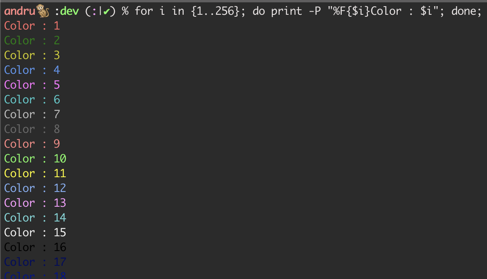

A simple way to create a simple colored prompt with [git](https://git-scm.com/) support which may look like this:


## TL;DR

1. If the **folder** `~/.zsh/` doesn't exist yet, run `mkdir ~/.zsh` to create it.
2. Run `git clone git@github.com:olivierverdier/zsh-git-prompt.git ~/.zsh/zsh-git-prompt`
3. Add the following at the top of your `~/.zshrc` file

    ```zsh
    # --- Configure zsh prompt ---
    source ~/.zsh/zsh-git-prompt/zshrc.sh
    PROMPT='%B%F{9}%n%F{reset}🐒 :%F{10}%C%F{reset}%b $(git_super_status) %# '
    ```

## Instructions with a bit more context

Follow these instructions on a unix system (like OSX on a Mac) in a [zsh](https://www.zsh.org/) shell 😉:

1. Get [zsh-git-prompt](https://github.com/olivierverdier/zsh-git-prompt)

    Clone the [zsh-git-prompt](https://github.com/olivierverdier/zsh-git-prompt) repository into the folder `~/.zsh/zsh-git-prompt` (`~` denotes the home directory).

2. Add the following at the top of `~/.zshrc`:

    ```zsh
    source ~/.zsh/zsh-git-prompt/zshrc.sh
    ```

3. Configure the colors

    Right below the line `source ~/.zsh/zsh-git-prompt/zshrc.sh` in my `.zshrc` file I add

    ```zsh
    PROMPT='%B%F{9}%n%F{reset}🐒 :%F{10}%C%F{reset}%b $(git_super_status) %# '
    ```

    **Notes**:

    - I picked colors **red** (`F{9}`) and **green** (`F{10}`)
    - I like emojis 😅. Do you want to keep the `🐒`?
    - Run the following to view all **256** possible color values:

        ```zsh
        for i in {1..256}; do print -P "%F{$i}Color : $i"; done;
        ```

        This should give you the following output (first few lines):

        
        
    - To adapt the colors, change the numbers, e.g. change `%F{9}` to `%F{5}` for a **pink** color.
    - Whatever is in-between `%F{your_color}` and `%F{reset}` takes on the chosen color `your_color`.
    - `%F{reset}` is important to reset the colors. Otherwise everything that followsf would keep the color set in `%F{your_color}`
    - [This StackOverFlow reply](https://stackoverflow.com/a/61153658/3210677) made me learn about this.

## Alternatives

- [Oh My Zsh](https://ohmyz.sh/) is the most popular alternative but all of the possible configurations and plugins overwhelmed me a bit. I like the simplicity of this approach.
