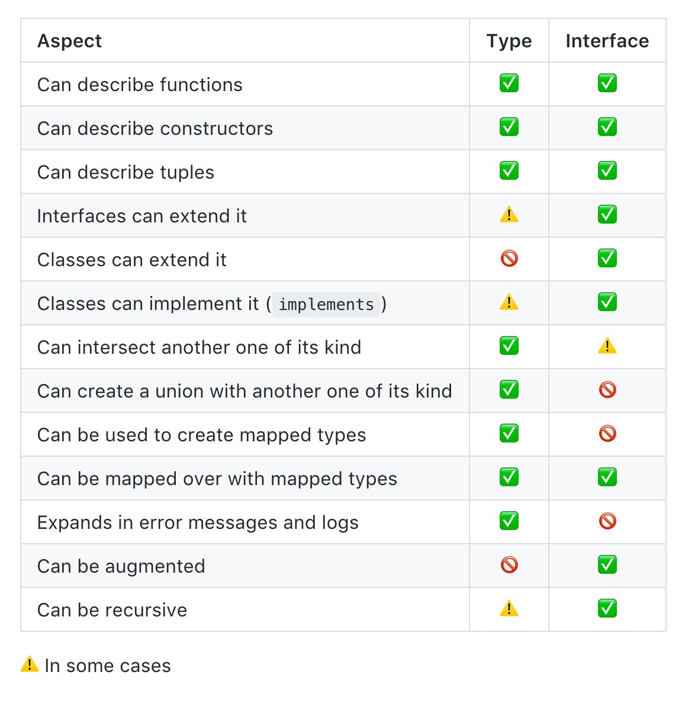

## Interfaces vs. type aliases

[TS docs have nice comparision](https://www.typescriptlang.org/docs/handbook/2/everyday-types.html#differences-between-type-aliases-and-interfaces).

### Main differences in a nutshell

- Type alias is more flexible, for example a union type `type info = string | { name: string };` is not possible with an interface which can only represent object-like data structures.


#### Computed Properties

- If you want to type a **class** or want to use **computed properties** (like `[key in Keys]: string`) you got to use type aliases.
- Error you get otherwise:

    ```
    A computed property name in an interface must refer to an expression whose type is a literal type or a 'unique symbol' type.(1169)
    ```

  - Here an **index signature** (the `in` command) is used:

    ```ts
    type Foo = 'a' | 'b';
    type Bar = { [key in Foo]: any };
    ```

---

- [Nice short article about the differences between `interface` and `type`](https://pawelgrzybek.com/typescript-interface-vs-type/)



### Similarities

Object types as interfaces or type aliases can both **be extended**

See the `extend` section in [TypeScript index](./index.md) file.

---

Interfaces definieren in TypeScript auch einen Typ und da TypeScript quasi Duck Typing verwendet, kannst du die meistens verwenden wie du lustig bist, d.h. ein Funktion die einen durch interface deklarierten Type akzeptiert nimmt auch das gleiche Objekt typisiert mit type entgegen und umkehrt. Gibt ein paar Ausnahmen, bspw. Union Types lassen sich meines Wissens nach nicht mit Interfaces definieren.
 Should I use Interface where I can and only use Type for complex cases where I need to define custom types that can’t be done with interface (or even computed values)?
Ja


Martin  6 hours ago
It depends - I personally like interfaces as I find them cleaner (especially with methods). Also I tend to not do type unions or anything like that if not needed - so my types keep clearer to reason about.
That said I prefer a more object oriented style of programming.
Types on the other side seem to be the better fit if you go more functional in your style.